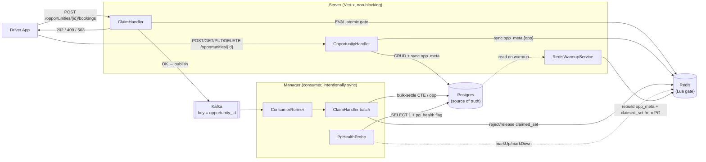
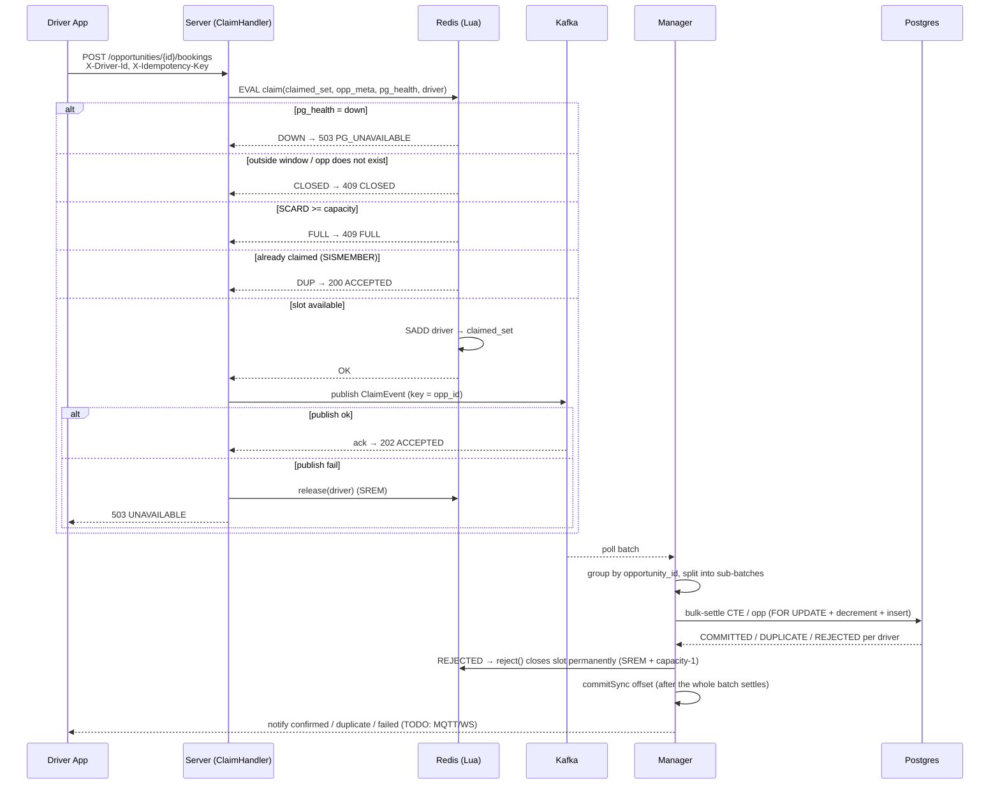

# System Design

This document describes the actual design of the *delivery opportunity claiming* system as
it exists in the source. The problem: one booking window opens → many drivers claim a single
opportunity with limited `capacity`, almost simultaneously (high contention on a single
partition — `opportunity_id`). Three requirements: **no overselling**, **low latency**
(fast-reject when full), **fault tolerance** (idempotent, at-least-once).

## Architecture overview

**Two-layer correctness**: the Redis gate prevents overselling *fast* (atomic Lua, single-key);
PG prevents overselling *correctly* (locked atomic decrement + `UNIQUE(opportunity_id, driver_id)`).
The system does not trust Redis absolutely — Redis is only fast-reject + fairness, PG is where
the decision is made.

## Request flow — one booking attempt

### Step details

1. **Server receives the request** (`BookingVerticle` → `ClaimHandlerImpl`), fully non-blocking
   on the event loop. Reads `opportunity_id` (path), `X-Driver-Id`, `X-Idempotency-Key` (header).
   Missing field → `400 BAD_REQUEST`.
2. **Redis Lua gate** (`VertxClaimGate`) — a single atomic `EVAL` over 3 keys
   (`claimed_set:{opp}`, `opp_meta:{opp}`, `pg_health`):
   - `pg_health == "down"` → `DOWN` (global kill switch, see the degrade section).
   - `opp_meta` does not exist, or `now() < window_start` → `CLOSED`.
   - `SCARD(claimed_set) >= capacity` → `FULL` (**fast-reject**, ~90% of traffic stops here,
     never touches the DB).
   - `SISMEMBER(claimed_set, driver)` → `DUP`.
   - Else `SADD` → `OK`. The SET both counts (SCARD) and dedupes (SISMEMBER) in the same atomic op.
3. **`OK` → publish to Kafka** (`VertxClaimProducer`, key = `opportunity_id`), then return
   `202 ACCEPTED` (not a synchronous success). **Publish fail** → `gate.release()` (SREM, returns
   the slot) + `503 UNAVAILABLE`. *No outbox/pending-set*: a claim not yet published is treated as
   never having happened, and the slot is released immediately in Redis.
4. **Manager consumer** (`ConsumerRunner` → `ClaimHandlerImpl`): polls a batch
   (`max.poll.records`), groups by `opportunity_id`, splits each opp into sub-batches
   (`settleBatchSize`). Opps **run in parallel** on a worker pool; sub-batches within the same opp
   **run sequentially** to avoid lock contention on the same `opportunities` row.
5. **PG bulk-settle** (`PgClaimStore`) — ONE CTE/sub-batch:
   `FOR UPDATE` locks the opportunity row → excludes drivers already booked (idempotency) →
   admits at most `remaining` new drivers by arrival order → `INSERT ... ON CONFLICT DO NOTHING`
   → decrements `remaining` by exactly the number inserted. Returns per-driver:
   `COMMITTED` / `DUPLICATE` / `REJECTED`. Backstop window: if `now()` is outside
   `[window_start, window_end]`, admittable capacity = 0.
6. **After settle**: `COMMITTED`/`DUPLICATE`/`failed` → notify the driver (currently a TODO
   MQTT/WS, only records the e2e-latency metric). `REJECTED` (passed the Redis gate but PG already
   has `remaining=0`) → `gate.reject()` **closes the slot permanently** (SREM + `capacity-1`) so
   the gate returns `FULL` rather than admitting a replacement driver that PG would reject again.
7. **Commit offset** only after the whole batch has settled (`commitSync`). A crash before commit →
   Kafka redelivers the batch → idempotent thanks to PG `UNIQUE` (DUPLICATE = no-op).

### Opportunity CRUD

`OpportunityHandlerImpl` + `JdbcOpportunityDao` provide `POST/GET/PUT/DELETE
/opportunities/{id}`. PG is the source of truth; each mutation **syncs `opp_meta:{opp}`** in Redis
(HSET capacity + window_start, `EXPIREAT` to window_end) so the gate on the claim path always
matches PG. Delete removes both `opp_meta` and `claimed_set`.

## Correctness under concurrency

- **No overselling** is guaranteed by PG, not Redis. The CTE locks the `opportunities` row
  (`FOR UPDATE`), admits only `rn <= remaining` drivers, and decrements by exactly the number
  inserted → even if the Redis gate is bypassed (degrade) or miscounts (restart), PG never exceeds
  `capacity`.
- **Idempotent / at-least-once**: `UNIQUE(opportunity_id, driver_id)` + `ON CONFLICT DO NOTHING`
  → Kafka redelivery or double-publish both yield `DUPLICATE`, never a double-book. Offset commit
  after settle ⇒ at-least-once, no lost events.
- **Partition by `opportunity_id`**: every claim of one opp goes to the same partition/consumer ⇒
  the manager groups + bulk-settles one CTE/opp/poll. No ordering needed (capacity is decided at
  the gate + PG); the trade-off: an ultra-hot opp is a hot partition (accepted to enable
  bulk-loading). Grouping/sorting by `opportunity_id` avoids deadlock between sub-batches.

## Failure & degrade

The system has **two independent circuit breakers** (Resilience4j) + one **global kill switch**:

| Failure | Mechanism | Behavior |
|---------|-----------|----------|
| **Redis down/timeout** (server) | CB around `gate.claim`. CB OPEN → skip gate | Returns `503 THROTTLED` (shed load, **not** degraded pass-through). PG remains the correctness backstop, but we lose fairness/fast-reject, so we deliberately shed. |
| **Redis restart / dataset loss** | `RedisWarmupService` runs periodically | The `warmup:heartbeat` sentinel (no TTL) disappears when Redis flushes → `restoreAll()` reads PG (`ReconciliationDao`) and rebuilds `opp_meta` + `claimed_set` for every open opp, then resets the heartbeat. During warmup, the PG backstop holds correctness. |
| **PG down/slow** (manager) | CB around each settle (>5s or error → OPEN) | The batch fast-fails `circuit_open`, does **not** release Redis/notify, and the offset is not committed → Kafka redelivers when half-open. CB transition OPEN → `PgHealth.markDown()` sets `pg_health=down` (TTL 30s). |
| **PG kill switch propagates to server** | Gate reads `pg_health` in Lua | The server returns `503 PG_UNAVAILABLE` for every claim → stops piling events onto a sick PG, upstream of Kafka. |
| **PG recovery while Kafka is quiet** | `PgHealthProbe` on a timer | With no traffic, the breaker has no settle to learn PG is healthy → probes `SELECT 1` through the *same* breaker; OPEN/HALF_OPEN + probe ok → close breaker → `markUp()` clears `pg_health` → server reopens. |
| **Kafka produce fail** (server) | `recover` in ClaimHandler | `gate.release()` + `503 UNAVAILABLE`; the driver retries (idempotency_key). |
| **Manager settle fail** (not the CB) | `onSettleFailed` | Releases claimed_set per driver + notifies `failed`; the offset is not committed → redeliver, idempotent thanks to UNIQUE (a driver may see a late "confirmed" overwrite "failed"). |
| **Manager crash** | Offset not yet committed | Re-consumes the batch after restart; `setInstances(2)` splits partitions within the same consumer group. |

## Key tradeoffs

- **Sync 202 ACCEPTED vs synchronous success**: return ACCEPTED right after the gate + publish,
  settle PG asynchronously in the manager → low latency, fast-reject, no HTTP connection held while
  waiting on the DB. In exchange, the final confirmation reaches the driver via push (TODO MQTT/WS),
  not the HTTP response.
- **Redis gate vs serializing everything through Kafka**: the Lua gate rejects ~90% at Redis
  (single-key ~100K ops/s) → Kafka/PG only see traffic that "could succeed". We do not serialize
  every attempt through Kafka.
- **Non-blocking server vs intentionally sync manager**: the server runs on the event loop (gate +
  producer return `Future`, no `executeBlocking`); the manager is throughput-bound (Kafka poll +
  JDBC), so we optimize with **batch settle of one CTE/sub-batch** + many partitions, with the poll
  loop running on a dedicated daemon thread (to avoid deadlock when blocking on
  `Future.all().get()` on a Vert.x worker context).
- **Shed load vs degraded pass-through**: both breakers choose to shed (`503`) rather than pass
  through — prioritizing staying correct + protecting downstream infrastructure over trying to
  accept bookings in an unguaranteed state.

## References

- [Tech stack](../02-techstack/techstack.md) · [Technical highlights](../03-technical-highlights/technical-highlights.md)
- [API](../04-api/api.md) · [Load tests](../05-loadtest/loadtest.md)
