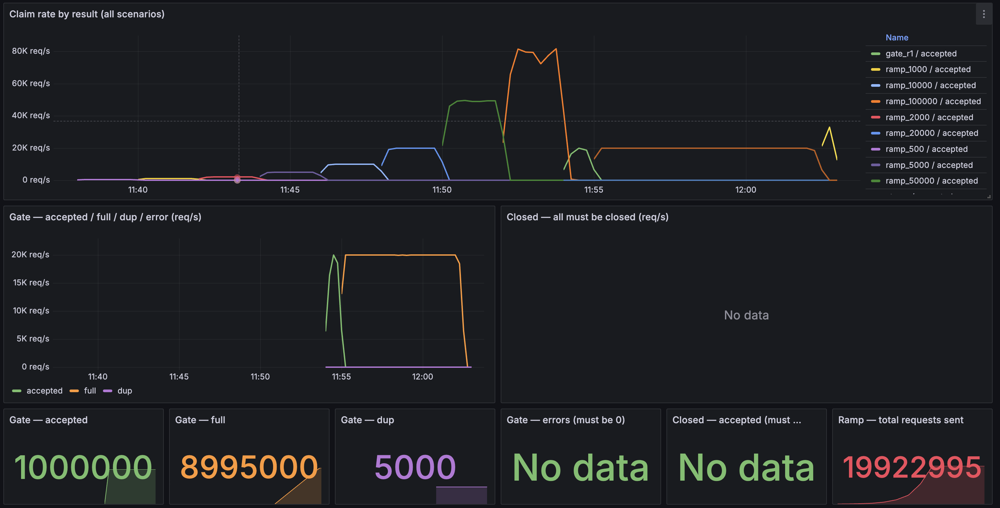
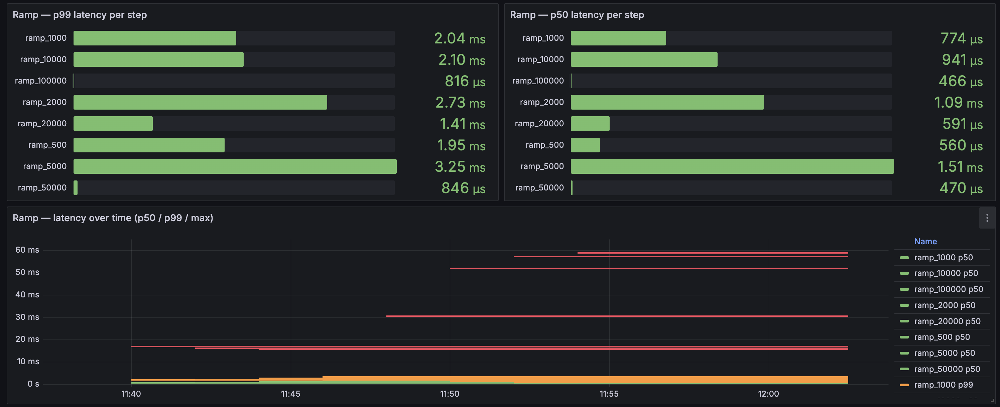
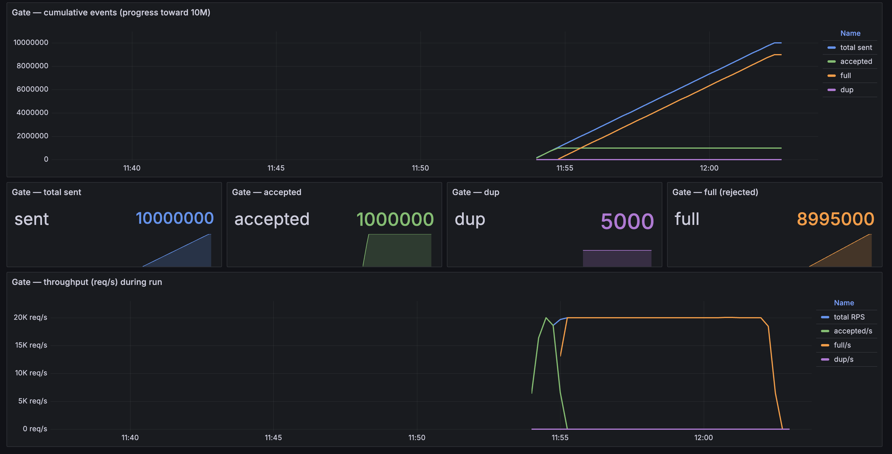
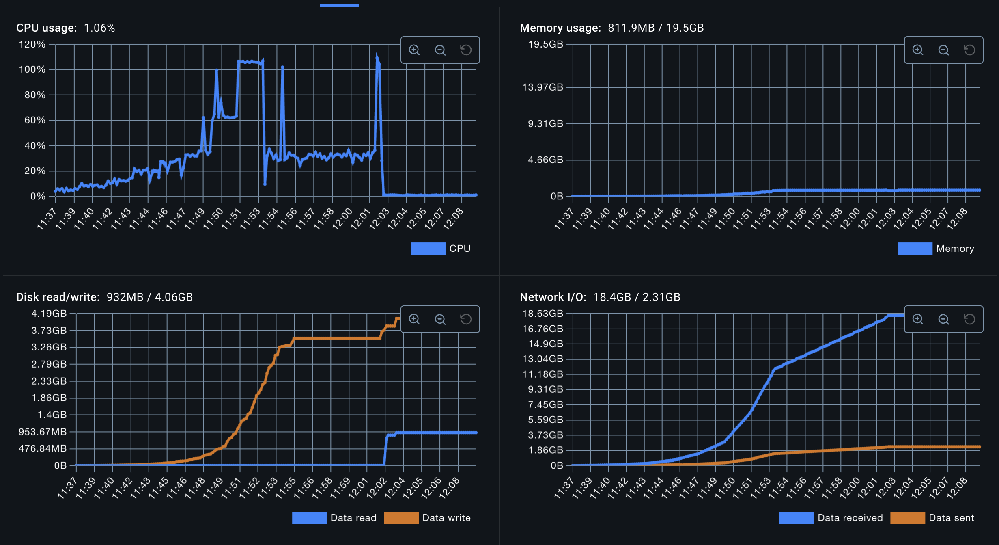

# Load Test — Redis Gate

Tests the Redis Lua EVAL gate in isolation — no HTTP server, no Kafka, no PG.

Source: `com/tm/loadtest/redis-counter/`

---

## Infrastructure

| | Redis | Load Generator |
|--|-------|---------------|
| **CPU** | 1 core (Docker cap) | unlimited |
| **RAM** | 2 GB (Docker cap) | unlimited |
| **Connection pool** | — | 500 conns |
| **Image** | `redis:7-alpine` | Bazel-built Go binary |

---

## Modes (`--run`)

| Mode | Description |
|------|-------------|
| `ramp` | Ramps RPS up: 500→1K→2K→5K→10K→20K→50K→100K, 2 minutes per step. Finds the throughput ceiling (error% > 5% or p99 > 100ms). |
| `gate` | Correctness: fires `--gate-requests` claims at one opportunity with `--capacity`, in 3 phases (seed dup → fire dup → rest). Asserts local tally == Redis SCARD == Prometheus. |
| `closed` | Fires requests at an opportunity whose window hasn't opened — 100% must return CLOSED, accepted == 0. |
| `stress` | Fires all requests fully concurrently (no ticker) — measures Redis's throughput ceiling when the client doesn't self-throttle. |
| `all` | Runs all modes in order. |

---

## Run configuration (docker-compose)

```
--run=all
--gate-requests=10_000_000
--capacity=1_000_000
--dup-n=5000          (5K duplicate drivers — ~5% of 1M accepted)
--gate-rps=20000
--pool=500
```

---

## Results

### Ramp Test

Finds the throughput ceiling of the Redis Lua gate (1 CPU, 2 GB RAM).

```
target    actual    sent       p50       p99        max        error%
────────────────────────────────────────────────────────────────────────
500       499       59,995     560µs     1.954ms    16.862ms   0.0%
1,000     999       120,000    774µs     2.043ms    16.154ms   0.0%
2,000     1,999     240,000    1.092ms   2.729ms    15.763ms   0.0%
5,000     4,999     600,000    1.513ms   3.253ms    16.231ms   0.0%
10,000    9,998     1,199,800  941µs     2.1ms      30.542ms   0.0%
20,000    19,992    2,399,200  591µs     1.414ms    52.019ms   0.0%
50,000    49,222    5,907,000  470µs     846µs      57.263ms   0.0%
100,000   78,287    9,397,000  466µs     816µs      58.838ms   0.0%
────────────────────────────────────────────────────────────────────────
Max sustainable RPS (error<5%, p99<100ms): ~78,287
```

**Notes:**
- The gate reaches ~78K actual RPS on 1 CPU; p99 stays below 1ms all the way to 50K RPS.
- The 50K→100K shortfall is client-side saturation (actual < target), not a Redis fault — p99 is still < 100ms, error% = 0%.
- Estimated Redis ceiling: **~80K RPS** for a single-key Lua EVAL on 1 CPU.
- At the target workload of 10K drivers/opp, the gate has ~8× headroom.



---

### Gate Correctness Test

```
rounds=1  capacity=1,000,000  requests=10,000,000  dup=5K  rps=20,000

latency  p50=556µs  p99=1.437ms

                              got        want
accepted                  1,000,000  1,000,000   ✓ no oversell
full                      8,995,000  8,995,000   ✓
dup                           5,000      5,000   ✓
SCARD (ground truth)      1,000,000              ✓ Redis ↔ local match

✓ no oversell: accepted == capacity
✓ full == restN - (cap - seedN)
✓ dup == dupN
✓ no errors
✓ no lost responses: total == sent
✓ SCARD == local accepted  (Redis ↔ observation)
```

**Notes:**
- 10M requests at 20K RPS (~8.3 minutes): no errors, no oversell.
- The three-way correctness check (local tally / Redis SCARD / Prometheus) matches exactly.
- ~90% of traffic is fast-rejected (FULL) at Redis — never touching Kafka or PG.
- p99 = 1.437ms at 20K RPS — comfortably within the SLO threshold.




---

## Metrics

| Metric | Description |
|--------|-------------|
| `loadtest_redis_claims_total{scenario,result}` | Counter: accepted / full / dup / closed / err_* |
| `loadtest_redis_latency_p50_seconds{scenario}` | p50 gauge by scenario |
| `loadtest_redis_latency_p99_seconds{scenario}` | p99 gauge by scenario |
| `loadtest_redis_latency_max_seconds{scenario}` | max gauge by scenario |

Grafana dashboard: `loadtest-redis-counter`



---

## Conclusion — is Redis a good fit?

**Yes.** For the target workload of ~10K drivers competing for one opportunity:

| Criterion | Requirement | Actual | Result |
|-----------|-------------|--------|--------|
| Throughput | ~10K RPS/opp | ceiling ~78K RPS (1 CPU) | ✓ **~8× headroom** |
| p99 latency at 20K RPS | < 10ms | 1.437ms | ✓ |
| Oversell (10M requests) | 0 | 0 | ✓ |
| Fast-reject when full | ~90% don't touch DB | 89.95% FULL at Redis | ✓ |
| Correctness (three-way check) | tally = SCARD = Prometheus | matches exactly | ✓ |
| Error rate | 0% | 0% | ✓ |

**Notes:**

- **Single-key bottleneck**: Lua EVAL is single-threaded per key — scaling CPU doesn't apply here. If one opportunity needs to exceed ~80K RPS, it must be sharded into N sub-counter keys.
- **Hot slot**: one Redis node carries all of an opportunity's traffic on the same CPU slot. With many opportunities running in parallel (each on its own key), total throughput scales linearly.
- **Redis state loss**: the gate is best-effort — final correctness is owned by the PG backstop. A Redis failure does not lose bookings; it only turns off fast-reject, pushing load onto Kafka → PG.
- **Memory**: 1M driver IDs in one `claimed_set` ≈ 50–80 MB/opportunity. With 2 GB RAM and many opportunities in parallel, TTL-based cleanup when the window closes is mandatory.

**Verdict**: the Redis Lua gate is a good fit for the assumed scale (~10K drivers/opp, many opportunities in parallel). No Redis Cluster or sub-counter sharding is needed at this scale.

The 100K+ threshold applies **per opportunity, not in aggregate**. Traffic spread across many opportunities scales linearly — each opportunity is an independent key in Redis, so 10 opportunities × 10K drivers = 100K requests/s in total with no contention between them. It only needs rethinking if *one* opportunity must carry 100K+ concurrent drivers.
